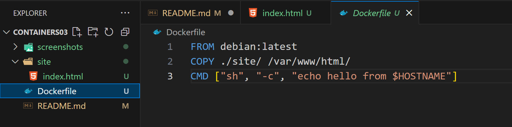
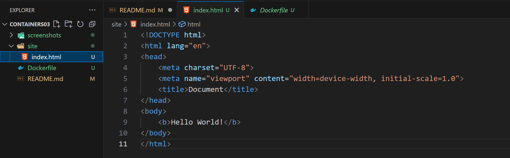
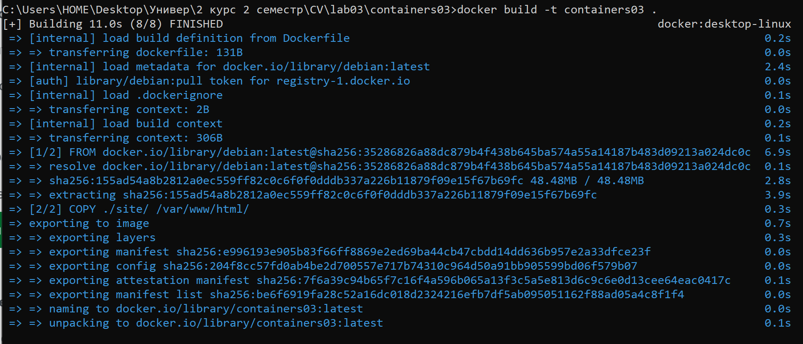
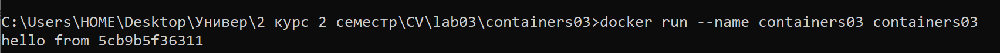
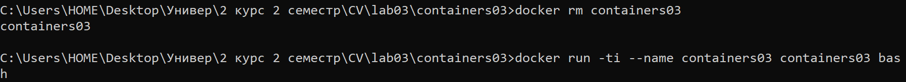
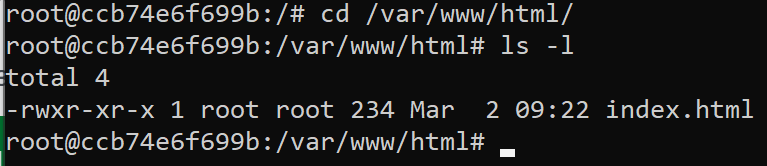

# Лабораторная работа №3. Первый контейнер

## Студент
**Gachayev Dmitrii I2302**  
**Выполнено 02.03.2025**  

## Цель работы
В этой лабораторной работе необходимо ознакомиться с основами контейнеризации и подготовить рабочее место для выполнения следующих лабораторных работ.
## Задача
Установить Docker Desktop и проверить его работоспособность.
## Выполнение работы
### Установка Docker Desktop и подготовка: 
1. Скачиваю Docker Desktop с официального сайта.

    https://app.docker.com/

2. Создаю репозиторий containers03 и клонирую его себе на компьютер через vscode.

3. Создаю в папке containers03 файл Dockerfile со следующим содержимым:

```
FROM debian:latest
COPY ./site/ /var/www/html/
CMD ["sh", "-c", "echo hello from $HOSTNAME"]
```




4. В той же папке проекта создаю папку site, в ней создаю файл index.html с произвольным содержимым:



## Запуск и тестирование

1. Открываю терминал и меняю папку на папку с проектом.

```bash
cd "C:\Users\HOME\Desktop\Универ\2 курс 2 семестр\CV\lab03\containers03"
```

2. Выполняю команду для создания образа:

```bash
docker build -t containers03 .
```



    Сколько времени создавался образ?

    Образ создавался 11 секунд.

3. Выполняю команду для запуска контейнера:

```bash
docker run --name containers03 containers03
```



    Что было выведено в консоли?

    В консоль вывелось `hello from 5cb9b5f36311`, то есть выполнился скрипт `["sh", "-c", "echo hello from $HOSTNAME"]` из Dockerfile, где $HOSTNAME — `5cb9b5f36311` уникальный идентификатор (id) моего контейнера, который автоматически присвоился при запуске и который необходим для различия с другими запущенными контейнерами.

4. Удаляю контейнер и запускаю снова, выполнив команды:

```bash
docker rm containers03
docker run -ti --name containers03 containers03 bash
```


Затем в открывшемся окне выполняю команды:

```bash
cd /var/www/html/
ls -l
```



Что выводится на экране?

- `total 4` - Общий размер файлов в директории (4 блока, размер блока 1 КБ).
- `-rwxr-xr-x` - Права доступа к файлу index.html. 
    - `-` - обычный файл (не директория).
    - `rwx` - владелец (root): чтение (r), запись (w), выполнение (x).
    - `остальные пользователи` - чтение (r), выполнение (x), нет записи (-).
- `1` - Количество ссылок на файл.
- `root` - Владелец файла (root).
- `root` - Группа, которой принадлежит файл.
- `234` - Размер файла в байтах (234 байта).
- `Mar 2 09:22` - Дата и время последнего изменения файла (2 марта, 09:22).
- `index.html` - Имя файла.

5. Использую команду 'exit' для выхода.

## Вывод
В ходе выполнения лабораторной работы был установлен Docker Desktop. После установки была проведена проверка работоспособности программы. Все операции были выполнены успешно, что подтвердило правильную настройку и готовность Docker для использования в следующих лабораторных работах.
## Библиография
1. Официальный сайт Docker. [https://app.docker.com/](https://app.docker.com/)
2. Официальная документация Docker. [https://docs.docker.com/](https://docs.docker.com/)
3. Курс Контейнеризация и виртуализация [https://moodle.usm.md/mod/assign/view.php?id=282116](https://moodle.usm.md/mod/assign/view.php?id=282116)
